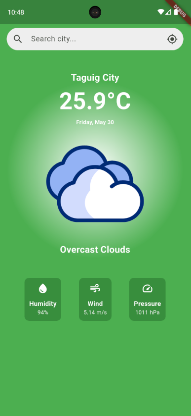

# 🌦️ KlimaTrack

**KlimaTrack** is a Flutter-based weather app built using Clean Architecture. It fetches weather data from the OpenWeatherMap API via JSON and XML formats, utilizing Dio for networking, BLoC for state management, and Geolocator for location-based weather updates.

Built with: Flutter 3.29.2
---

## 📱 Features

- Fetch real-time weather using **OpenWeatherMap API**
- Support for **JSON** and **XML** formats
- Location-based weather using **Geolocator**
- **Clean Architecture** with separation of concerns
- State management using **BLoC**
- Custom loading, error, and data widgets
- Light-weight and scalable project structure
- Responsive UI with animated weather icon

---

## 📸 App Preview



---

## 🧱 Project Structure

```bash
lib/
├── core/
│ ├── injectors/
│ └── services/
├── data/
│ ├── models/
│ └── repositories/
├── domain/
│ ├── entities/
│ ├── repositories/
│ └── usecases/
├── features/
│ ├── homepage/
│ │ └── presentation/
│ │ ├── bloc/
│ │ ├── pages/
│ │ └── widgets/
│ └── splash/
└── main.dart
```
---

## 📦 Dependencies

### Main

```yaml
dependencies:
  flutter: sdk: flutter
  animate_do: ^4.2.0
  bloc: ^8.1.4
  dio: ^5.8.0+1
  equatable: ^2.0.7
  flutter_bloc: ^8.1.6
  freezed: ^2.4.7
  freezed_annotation: ^2.4.1
  geolocator: ^11.0.0
  get_it: ^7.6.4
  intl: ^0.20.2
  json_annotation: ^4.9.0
  xml: ^6.5.0
```

### Dev

```yaml
dev_dependencies:
  build_runner: ^2.4.8
  flutter_lints: ^4.0.0
  flutter_test:
    sdk: flutter
  json_serializable: ^6.7.1
```

---

## 🚀 Getting Started

1. **Clone repo**

   ```bash
   git clone https://github.com/your-username/KlimaTrack.git
   cd KlimaTrack
   ```

2. **Get packages**

   ```bash
   flutter pub get
   ```

3. **Run build runner**

   ```bash
   flutter pub run build_runner build --delete-conflicting-outputs
   ```

4. **Run the app**

   ```bash
   flutter run
   ```

---

## 🔐 API Setup

Open `lib/core/constants/constants.dart` and insert your OpenWeather API key:

```dart
const String apiKey = 'YOUR_OPENWEATHER_API_KEY';
```

---

## 👨‍💻 Tech Stack

| Layer      | Tools/Approach             |
| ---------- | -------------------------- |
| UI         | Flutter Widgets            |
| State Mgmt | BLoC                       |
| Network    | Dio                        |
| Location   | Geolocator                 |
| Dependency | GetIt                      |
| Codegen    | Freezed, Json Serializable |
| Format     | JSON & XML support         |


